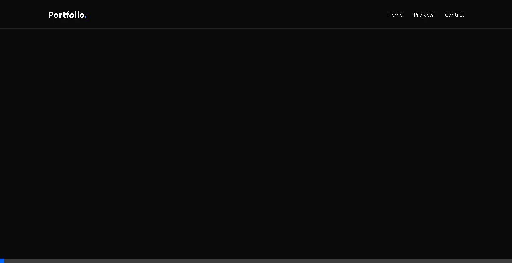

# Amin Aguilal - Portfolio



## Overview
This is my personal portfolio website, built to showcase my career in **IT Project Management** and **Development**. It features a modern, high-performance UI with smooth animations.

## Tech Stack
-   **Framework**: React + Vite
-   **Styling**: Vanilla CSS (Variables + Modern Layouts)
-   **Animation**: Framer Motion
-   **Deployment**: GitHub Pages / Vercel (Ready)

## Features
-   **Hero Section**: Animated introduction.
-   **About Me**: Bio, skills, and languages.
-   **Experience**: Timeline of professional roles.
-   **Projects**: Showcase of NLP and AI work.
-   **Contact**: Direct Gmail integration.

## Getting Started
1.  Clone the repo:
    ```bash
    git clone https://github.com/iiSnow01/Portfolio.git
    ```
2.  Install dependencies:
    ```bash
    npm install
    ```
3.  Run dev server:
    ```bash
    npm run dev
    ```
